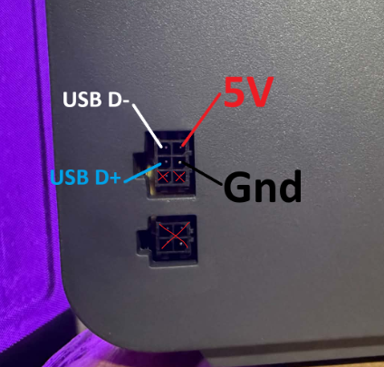

# Anycubic ACE Pro / ACE 2 Pro

Anycubic ACE support integrates ACE Pro and ACE 2 Pro units with the Snapmaker
U1 as optional filament storage, feed assist, retract, dryer, RFID/status, and
gate-status devices.

This feature is disabled by default and is experimental.

## Upstream References

This integration is a clean Extended Firmware port informed by these projects:

- BlackFrogKok/SnapAce, commit `34a06e87bcd59ca3ebc845ed32a794627505437c`
- DnG-Crafts/U1-Ace, commit `f845339800445269069a60a55c9e517911c3f2f4`
- hakimio/U1-Ace `ace2`, commit `97e94b11f6f9b52e045dc89919f69405dda1d9cf`
- utkabobr/DuckACE
- printers-for-people/ACEResearch
- decay71/multiACE issue #46 for CH340 USB-to-RS485 ACE 2 Pro validation notes
- Extended Firmware U1 + ACE 2 Pro validation with a CH340 `1a86:7523`
  USB-to-RS485 adapter

## Supported Models

The user-facing models are:

- Anycubic ACE Pro
- Anycubic ACE 2 Pro

Internally, ACE Pro uses a JSON serial protocol at `115200` baud. ACE 2 Pro
uses a protobuf serial protocol at `230400` baud.

## Config Lifecycle

When Anycubic ACE is disabled, the editable config file does not exist.
Firmware Config creates it at enable time from this built-in template:

```bash
/usr/local/share/firmware-config/tweaks/klipper/ace.cfg
```

After enabling, edit or inspect the active config here:

```bash
/oem/printer_data/config/extended/klipper/ace.cfg
```

## Firmware Config Settings

Open Firmware Config at `http://<printer-ip>/firmware-config/`, then use:

**Snapmaker Components > Anycubic ACE**

Settings in this group:

- **Anycubic ACE** — Disabled / Enabled
- **ACE Model** — Auto Detect / Anycubic ACE Pro / Anycubic ACE 2 Pro
- **Filament Assist Source** — ACE Feed Assist / U1 Feeders / Off

ACE also appears in the shared RFID settings:

- **RFID Hardware** — Snapmaker / External / ACE
- **RFID Software** — Snapmaker / OpenRFID / OpenRFID (generic) / ACE

The ACE options in RFID Hardware and RFID Software only appear when Anycubic ACE is enabled.

### ACE Model

- `Auto Detect` - detect a supported ACE model from `/dev/serial/by-id`
- `Anycubic ACE Pro` - force ACE Pro JSON protocol
- `Anycubic ACE 2 Pro` - force ACE 2 Pro protobuf protocol

### Filament Assist Source

Only one assist source can be active:

- `ACE Feed Assist` - ACE handles feed assist while printing
- `U1 Feeders` - U1 feeders handle the assist path
- `Off` - no feed assist

This avoids unsafe combinations where both ACE and U1 feeder assist try to
control the same filament path.

### RFID Hardware / RFID Software

RFID detection is split into hardware (physical reader) and software (tag
decoder). Select ACE as the hardware reader to use the ACE slot RFID
reader. Select ACE as the software decoder to use ACE-format NTAG tags
(written via U1-RFID app with Ace Format).

Valid combinations:

| Hardware | Software | Effect |
|---|---|---|
| Snapmaker | Snapmaker | U1 built-in reader, stock decoder |
| Snapmaker | OpenRFID | U1 built-in reader, OpenRFID decoder (Bambu/Creality) |
| External | *(hidden)* | External reader, self-contained |
| ACE | ACE | ACE slot reader, ACE-format tags |
| ACE | OpenRFID | ACE slot reader, OpenRFID decoder (future) |

## USB Detection

With `device_model: auto`, the model and serial path are detected automatically
— no manual configuration needed. If you need to verify or troubleshoot:

```bash
lsusb
ls -l /dev/serial/by-id/
```

Expected ACE Pro path:

```bash
/dev/serial/by-id/usb-ANYCUBIC_ACE_1-if00
```

Expected ACE 2 Pro path pattern:

```bash
/dev/serial/by-id/usb-1a86_USB_Single_Serial_*
```

Community-tested CH340 USB-to-RS485 adapters may enumerate differently:

```bash
/dev/serial/by-id/usb-1a86_USB_Serial-if00-port0
/dev/ttyUSB0
/dev/serial/by-path/platform-...-port0
```

The CH340 path `usb-1a86_USB_Serial-if00-port0` has been validated with ACE
2 Pro using a USB-to-RS485 adapter. If the adapter appears in `lsusb` and
`/dev/serial/by-id/` but ACE commands time out, the firmware is usually
sending successfully but not receiving an RS485 reply. In that case, keep
`GND` connected and swap only the RS485 `A`/`B` pair.

A manual `serial:` override is only needed if your ACE enumerates with a
non-standard USB id. In that case update the path in:

```bash
/oem/printer_data/config/extended/klipper/ace.cfg
```

and restart Klipper.

## Cable Requirements

ACE Pro and ACE 2 Pro use different cable approaches.

Parts by model:

| Model | Required parts |
|---|---|
| ACE Pro | Micro-Fit 3.0 2x3P pigtail connector, USB 2.0 cable or USB-A breakout |
| ACE 2 Pro | Micro-Fit 3.0 2x3P pigtail connector, USB-to-RS485 adapter |

**ACE 2 Pro only:** use a USB-to-RS485 adapter. Prefer CH343 when available
because it is closest to the original Anycubic USB-to-RS485 signal cable
behavior. CH340/CH341 adapters are cheaper and community-tested; CH340
adapters that enumerate as `1a86:7523` have been validated for basic ACE 2 Pro
status, temperature, gate status, and dryer control.

Do not use a direct USB cable for ACE 2 Pro.



```text
ACE-side 6-pin signal connector, front/mating side
Clip/latch side at the top

             clip/latch
                ||
      +-------------------+
      | [NC]  [D+]  [D-]  |
      | [NC]  [GND] [5V]  |
      +-------------------+
```

**Warning:** The `5V` pin is shown for identification only. Do not connect it to
anything. Connecting `5V` can damage the ACE, adapter, printer, or host USB
port. Use only the documented data/signal pins and ground.

For ACE Pro, `D+` and `D-` are the USB data pair. For ACE 2 Pro, the same
physical connector orientation is useful, but ACE 2 Pro needs an RS485 adapter
path instead of direct host USB `D+`/`D-`.

Typical USB 2.0 wire colors:

| USB color | Typical signal |
|---|---|
| Red | `5V` - do not connect |
| White | `D-` |
| Green | `D+` |
| Black | `GND` |

Verify the cable with a multimeter before connecting it. Cheap USB cables do
not always follow the color standard.

### Anycubic ACE Pro

ACE Pro uses the original SnapAce-style USB serial path:

```text
U1 USB port
    |
    |  USB 2.0 cable or USB-A breakout
    |
 [splice/join D-, D+, and GND]
    |
    |  Micro-Fit 3.0 2x3P pigtail connector
    |
 ACE Pro signal port
```

Wire the USB cable to the Micro-Fit pigtail:

| USB cable wire | ACE Pro signal connector |
|---|---|
| USB `D-` | `D-` |
| USB `D+` | `D+` |
| USB `GND` | `GND` |
| USB `5V` | Do not connect |

### Anycubic ACE 2 Pro

ACE 2 Pro uses an RS485 serial path:

```text
U1 USB port
    |
    |  USB
    |
 USB-to-RS485 adapter
    |
    |  RS485 A/B and GND
    |
 [splice/join A, B, and GND]
    |
    |  Micro-Fit 3.0 2x3P pigtail connector
    |
 ACE 2 Pro signal port
```

Wire the RS485 adapter to the Micro-Fit pigtail:

| Adapter label | ACE 2 Pro signal | Notes |
|---|---|---|
| `GND` | Ground | Always required |
| `A`, `485+`, or `D+` | Try both `D+` and `D-` | Swap if ACE commands time out |
| `B`, `485-`, or `D-` | Try both `D-` and `D+` | Swap if ACE commands time out |
| `VCC` | Do not connect | Always leave disconnected |

Notes:

- ACE 2 Pro should be on firmware `1.1.31` or newer.
- **RS485 adapter labels are not standardized.** The most common issue is
  swapped `A`/`B` polarity: keep `GND` connected and try both orientations
  for the `A`/`B` pair. If the adapter enumerates but ACE commands time out,
  swap only the RS485 `A` and `B` wires. A working link should show real
  `ACE_GET_TEMP` values and non-timeout `ACE_GET_STATUS` responses.
- CH340/CH341 adapters may enumerate as `1a86:7523` and may need this udev
  rule:

```text
SUBSYSTEM=="tty", ATTRS{idVendor}=="1a86", ATTRS{idProduct}=="7523", MODE="0666", GROUP="dialout"
```

After adding the rule, reload udev rules and reconnect the adapter or reboot
the printer.

### ACE 2 Pro Validation

After enabling Anycubic ACE and selecting Auto Detect or Anycubic ACE 2 Pro,
restart Klipper and run:

```gcode
ACE_GET_STATUS
ACE_GET_TEMP
ACE_DRYING_ON
ACE_GET_STATUS
ACE_GET_TEMP
ACE_DRYING_OFF
```

A working ACE 2 Pro link should report:

- `Model: Anycubic ACE 2 Pro`
- `Protocol: protobuf`
- `Connected: yes`
- gate status such as `[0, 0, 0, 0]`
- non-zero temperature and humidity values
- dryer status changing to `keeping` after `ACE_DRYING_ON`

If the adapter enumerates but the commands time out, check Klipper logs:

```bash
grep -iE 'ACE: dropped stale ACE 2 Pro|ACE 2 Pro reader error|ACE 2 Pro writer error' /home/lava/printer_data/logs/klippy.log | tail -80
```

Repeated stale ACE 2 Pro requests with no successful status, temperature, or
dryer response usually means the RS485 receive side is not wired correctly.
The most common fix is swapping `A` and `B` while leaving `GND` unchanged.

## Configuration

Important values in `extended/klipper/ace.cfg`:

```ini
device_model: auto
assist_source: snapmaker
rfid_source: existing

feed_length_slot1: 1000
load_length_slot1: 850
retract_length_slot1: 3000
max_dryer_temperature: 55
```

Tune all four slot lengths for your tube routing. Start with short manual
movement tests before running full load/unload workflows.

## Commands

- `ACE_FEED INDEX=<0-3> LENGTH=<mm> [SPEED=<mm/s>]`
- `ACE_RETRACT INDEX=<0-3> LENGTH=<mm> [SPEED=<mm/s>]`
- `ACE_ENABLE_FEED_ASSIST INDEX=<0-3>`
- `ACE_DISABLE_FEED_ASSIST INDEX=<0-3>`
- `ACE_START_DRYING TEMP=<C> DURATION=<minutes>`
- `ACE_STOP_DRYING`
- `ACE_GET_STATUS`
- `ACE_GET_TEMP`

Convenience macros:

- `ACE_FEED_SLOT1`–`ACE_FEED_SLOT4`
- `ACE_RETRACT_SLOT1`–`ACE_RETRACT_SLOT4`
- `ACE_ASSIST_ON` / `ACE_ASSIST_OFF`
- `ACE_STATUS` / `ACE_TEMP`
- `ACE_DRYING_ON` / `ACE_DRYING_OFF`

## Disabling

Set **Anycubic ACE** back to **Disabled** in Firmware Config.
This removes `extended/klipper/ace.cfg` and restarts Klipper, returning filament
feeding to the stock U1 path.

## RFID Filament Detection

When `rfid_source: ace` and an ACE slot RFID tag is detected, the ACE driver
automatically sets filament configuration for the matching extruder. For ACE
2 Pro, a separate `get_filament_info` request is sent to retrieve richer data
including:

- Filament type and vendor
- Color (RGBA)
- Extruder temperature range (min/max)
- Hot bed temperature range (min/max)
- Filament diameter

For ACE Pro, color and type are read directly from the status response.

## Limitations

- ACE hardware must enumerate as a serial device before firmware can connect.
- ACE 2 Pro-specific protocol features (`ACE_UPDATE_SPEED`, `ACE_UNWIND_ASSIST`)
  are not available on ACE Pro.
- RFID ownership is intentionally limited to one active source to avoid
  conflicts with existing Extended Firmware RFID/OpenRFID settings.
