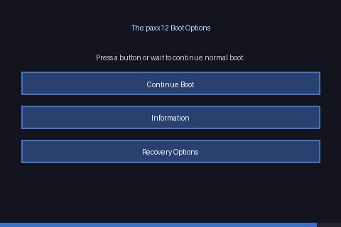
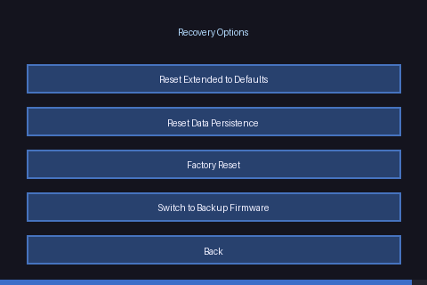

# Recovery

Several recovery options are available depending on what is accessible:

| Method | When to use |
|--------|-------------|
| [Recovery Screen](#recovery-screen) | Before Klipper starts; no network or SSH needed |
| [Firmware Config web interface](#firmware-config-web-interface) | Printer is on the network |
| [USB recovery file](#usb-recovery-file) | Network is down; no display access |

---

## Recovery Screen

The recovery screen is a full-screen touch interface that appears at boot
time, before Klipper starts. It provides access to all reset and diagnostic
operations directly on the printer display.

### Activation

**To activate: when the paxx12 extended logo appears at boot, tap the screen
three times in quick succession.**

Three dots in the bottom-right corner fill in as each tap is registered. If a
second passes between taps without a new one, the count resets and boot
continues normally.

### Main Menu

A progress bar along the bottom counts down the auto-close timeout (60
seconds). Any button press resets the timer. When the timer expires, the
screen closes and boot continues normally.

- **Continue Boot** — closes the recovery screen and continues normal boot
- **Information** — displays serial, MAC addresses, eMMC lifetime, firmware version, and active slot
- **Recovery Options** — opens the recovery submenu

### Recovery Options

- **Reset Extended to Defaults** — see [Reset Extended to Defaults](#reset-extended-to-defaults)
- **Reset Data Persistence** — see [Reset Data Persistence](#reset-data-persistence)
- **Reset User Changes** — see [Reset User Changes](#reset-user-changes)
- **Switch to Backup Firmware** — see [Switch to Backup Firmware](#switch-to-backup-firmware)
- **Information** — same diagnostics output as the main menu

---

## Firmware Config Web Interface

Access at `http://<printer-ip>/firmware-config/` → **Troubleshooting**.

Available actions:

- **Reset Extended to Defaults** — equivalent to [Reset Extended to Defaults](#reset-extended-to-defaults)
- **Reset Extended to Backup Firmware** — resets extended config and switches to the backup firmware slot
- **Restart Klipper / Moonraker / Reboot System** — restart individual services or the whole printer

---

## USB Recovery File

If the printer cannot be reached over the network and the touch screen is
not accessible:

1. Create an empty file named `extended-recover.txt` on a USB drive
   (both `extended-recover.txt` and `extended-recover.txt.txt` are recognised,
   so Windows users who have "Hide extensions for known file types" enabled
   do not need to take special steps)
2. Insert the USB drive into the printer
3. Restart the printer
4. The extended configuration is backed up to `extended.backup.N` and reset to defaults
5. Remove the USB drive (the recovery file is deleted automatically)

This is equivalent to [Reset Extended to Defaults](#reset-extended-to-defaults).

---

## Recovery Actions

### Reset Extended to Defaults

Clears all extended firmware configuration (`extended2.cfg` and related
files) and regenerates it from defaults on the next boot.

Use when a bad configuration change prevents Klipper or Moonraker from
starting, or to reset authentication settings after a forgotten password.

> **Note:** This resets ALL extended configuration — camera, VPN, login
> settings, etc. — not just the setting that caused the problem.

**Available via:**
- Recovery Screen → Recovery Options → Reset Extended to Defaults
- Firmware Config → Troubleshooting → Revert Changes
- USB recovery file (`extended-recover.txt`)

### Reset Data Persistence

Removes `/oem/.debug`, clearing runtime state that persists across reboots,
without touching the extended configuration. Use when persistent state is
causing unexpected behaviour.

See [Data Persistence](data_persistence.md) for background.

**Available via:**
- Recovery Screen → Recovery Options → Reset Data Persistence

### Reset User Changes

Clears extended configuration, data persistence, and printer data
(`/oem/.printer_data`) in one step, then reboots.

> **Warning:** All customised configuration including WiFi credentials,
> camera settings, VPN configuration, and Klipper overrides will be lost.

**Available via:**
- Recovery Screen → Recovery Options → Reset User Changes

### Switch to Backup Firmware

Switches the active A/B firmware slot and reboots. Use this to recover from
a failed firmware upgrade by booting the previously working slot.

Also clears data persistence (`/oem/.printer_data`, `/oem/.debug`) before
switching.

**Available via:**
- Recovery Screen → Recovery Options → Switch to Backup Firmware
- Firmware Config → Troubleshooting → Reset Extended to Backup Firmware (also resets extended config)

