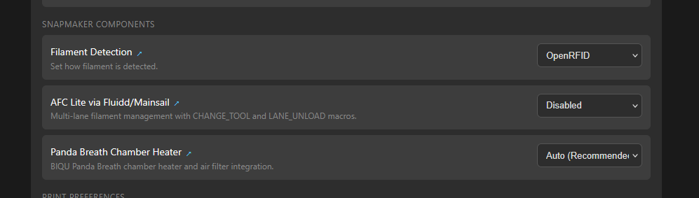
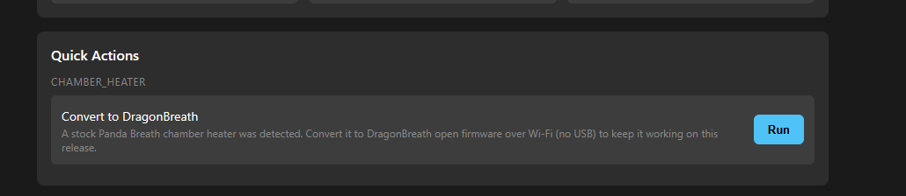
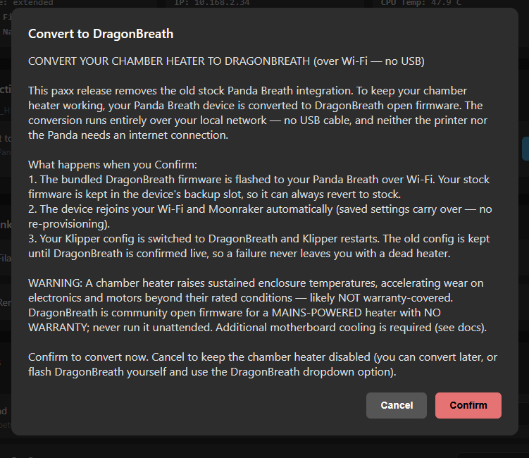
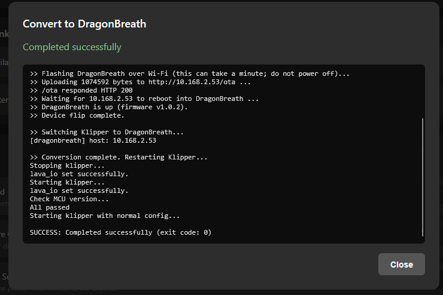
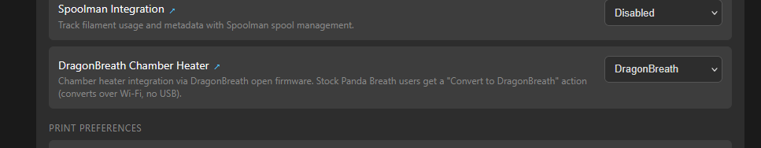

# No-USB Panda → DragonBreath migration (paxx 1.6.0) — design

Status: **Bench-validated end-to-end; submitted upstream.** paxx 1.6.0 removes
the stock-Panda chamber-heater path and converts everyone to DragonBreath. Any user
still on **stock Panda firmware** with the old `panda_breath.cfg` gets a dead heater on
update unless we convert them — **over the network, no USB.** This overlay is where the
conversion lives; it builds on PR 604's structure.

## Walkthrough — the conversion in action

Captured on a real U1 + Panda Breath bench (stock Panda → DragonBreath, no USB, no
internet). Validated from **both stock 1.0.3 and 1.0.4** Panda firmware — the stock
`/ota` handler is byte-identical on both (and paxx 1.5.2 now supports 1.0.4 Pandas).

**1. Before** — the stock Panda Breath chamber-heater integration (paxx ≤ 1.5.x).


**2. Convert action appears** — after updating, a `if_cmd`-gated "Convert to DragonBreath"
button shows for a user still on stock Panda.


**3. Consent** — Accept/Deny modal explaining the over-Wi-Fi conversion + the safety notes.


**4. Live conversion** — flashes the bundled image over Wi-Fi (`/ota` → HTTP 200), reboots
into DragonBreath v1.0.2, the shim carries Wi-Fi + Moonraker, the Klipper config swaps, and
klippy restarts. All streamed to the UI.


**5. After** — the chamber heater is now DragonBreath.


## Already done (the hard half)
- **DragonBreath firmware v1.0.2** ships a first-boot NVS carry-over shim: after an
  OTA-over-stock it reads stock's `app_nvs` `wifi_info` / `moonraker_info` / `ha_mqtt_info`
  blobs and rejoins the same **WiFi + Moonraker + HA** with no re-provisioning
  (hardware-validated). So the device side of the flip is seamless — the printer side is
  what's left.
- **Klipper module (`dragonbreath-klipper`): no changes required.** It verifies the
  device is DragonBreath-v2 on handshake (won't accept stock), rides out the flash/reboot
  window with automatic reconnect+backoff, and exposes `connected`/`firmware_version` for
  post-flip verification. Migration = write `[dragonbreath] host` cfg + restart klippy.
  (An optional standalone `GET /api/v2/info` probe CLI could be added for the orchestrator
  to call pre-restart, but it can just do the HTTP check itself. Deferred.)

## Two execution phases (don't conflate)
- **Build-time** (`scripts/*.sh`, run in `create_firmware.sh` on the build host): bake the
  Klipper module and — new — the **pinned DragonBreath `.bin`** into the rootfs.
- **Runtime** (settings-YAML `cmd`/`get_cmd`, run on the U1 by `firmware-config.py`): the
  conversion orchestrator, launched from the chamber-heater dropdown.

## The conversion flow (runtime, on the U1)
Idempotent + resumable; consent-gated; fails loud (a quietly-dead heater after a forced
update is the worst outcome).

**No device-firmware detection is needed.** Mainline paxx never shipped DragonBreath —
only testers run it (via the PR 604 build), and they already have `dragonbreath.cfg`. So
the population is unambiguous and the existing host-side `get_cmd` already classifies it:
`panda_breath.cfg` present ⇒ **stock user ⇒ migrate**; `dragonbreath.cfg` present ⇒
already on DragonBreath ⇒ **skip**; neither ⇒ disabled. The trigger is the config state,
not a probe of the device.

1. **Read the device host** from `panda_breath.cfg` (`host`, e.g. `PandaBreath.local` or
   the saved IP) — that's where we POST. One small **idempotency/resume guard**: a quick
   `GET http://<host>/api/v2/info` — if it *already* answers `project=dragonbreath` (a
   prior run flashed but didn't finish the cfg-swap), **skip the flash and jump to the cfg
   swap.** This is "already done?", not "is it stock?". Unreachable ⇒ surface "needs
   attention" and let the user retry.
2. **Flash** the bundled `dragonbreath-<ver>.bin` to the stock firmware-update endpoint
   (⚠ **the one thing to RE — see below**). Stock writes it to the inactive OTA slot and
   reboots into it; the **stock app stays in the other slot** (boot-inactive rollback,
   since DragonBreath ships on the stock partition layout). No internet needed (image is
   bundled).
3. **Wait + verify.** Re-resolve `dragonbreath.local` / same IP; confirm
   `GET /api/v2/info` `project=dragonbreath` + version. WiFi/Moonraker/HA carried by the
   v1.0.2 shim.
4. **Swap the Klipper config.** Same mechanics PR 604 already uses: `rm` `panda_breath.cfg`
   (unbind first via `panda_breath_cli.py … unbind` while it's still stock, if reachable),
   `cp -n dragonbreath.cfg`, `extended-config.py add … dragonbreath host <ip>`, chown lava.
   Carry the user's setpoint/mode where we can.
5. **Reload Klipper** — `S60klipper restart` (process restart; the module only loads then,
   NOT `FIRMWARE_RESTART`).
6. **Verify + finalize** — poll the `dragonbreath` object (`connected`/`firmware_version`)
   via Moonraker; then mark the dropdown DragonBreath. On failure, keep the old cfg and
   report — never leave it half-swapped.

## Components — SCAFFOLDED (local, on `feature/dragonbreath-migration`)
- ✅ **`scripts/03-bundle-dragonbreath-firmware.sh`** (build-time) — `cache_file.sh` the
  pinned `dragonbreath-v1.0.2.bin` (GitHub release, sha256-verified) into
  `root/usr/local/share/chamber-heater/dragonbreath.bin`. **Bundled at build time, not
  fetched at migrate time** — the printer/Panda are never assumed to have internet; only
  the CI/build host does. Shipped **uncompressed** (~1.08 MB in a ~270 MB image; a
  compiled ESP `.bin` compresses to ~0.6 MB and a compressed bundle would add a decompress
  failure mode on the U1 at migrate time — not worth ~0.4 MB). Version pinned alongside
  the `GIT_SHA` pin in `01-install-dragonbreath.sh`.
- ✅ **`root/usr/local/bin/dragonbreath_migrate.py`** (new, stdlib-only) — `probe` (GET
  `/api/v2/info`, is it DragonBreath?), `flash` (POST the local `.bin` to stock `/ota`),
  `wait_for_dragonbreath`, and `migrate` (idempotent: probe→skip-if-done→flash→wait). The
  `--image` default is the bundled path; flash is over the **LAN**, no internet. Probe
  validated by IP against the bench (returns `dragonbreath`).
- ✅ **`25_settings_..._chamber_heater.yaml`** (edited) — **removed `panda-auto`**. Dropdown
  is now just **Disabled / DragonBreath** (two real end states). `get_cmd`:
  `dragonbreath.cfg` → `dragonbreath`, else `disabled`. `dragonbreath` (manual) option kept
  for users who flashed themselves. **The migration is NOT a dropdown option** — see below.
- ✅ **`24_actions_chamber_heater.yaml`** (new) — the migration is a **quick-action button
  "Convert to DragonBreath"**, not a dropdown state. WHY: a firmware-config `<select>` fires
  its `cmd` only `onchange`, so a pre-selected `migrate` state never fired, and the only
  escapes were destructive (Disabled deletes the migration source). An action button fires on
  **click**, is gated by `if_cmd: test -f …/.needs-migration` (appears *only* for a pending
  stock-Panda user, vanishes once converted), and carries the **Accept/Deny** consent as its
  `confirm` modal (Confirm/Cancel). Its `cmd` is the orchestrator (read host from the Panda
  cfg → `dragonbreath_migrate.py migrate` → cfg-swap `panda_breath*`→`dragonbreath.cfg`
  carrying the host → clear pending+flag → restart klippy; fails loud, leaves cfg intact on
  flash failure). **Validated end-to-end on real hardware (2026-07-31):** stock Panda
  **1.0.3 and 1.0.4** → clicked the button → flashed DragonBreath v1.0.2 over LAN → shim
  carried WiFi+Moonraker → `[dragonbreath]` live (`connected:true`, 36 °C).
- ✅ **`root/etc/init.d/S58chamber-migration-guard`** (new) — runs **before** S60klipper;
  renames a lingering `panda_breath.cfg`→`.pending-migration` + drops `.needs-migration` so
  klippy starts clean (1.6.0 deleted the `panda_breath.py` module) and the dropdown shows
  the conversion. Idempotent. So an un-migrated user gets a *disabled* heater, never a
  *broken printer*.
- ✅ **Removed Panda:** deleted `scripts/02-install-panda-breath.sh`, `panda_breath_cli.py`,
  `panda_breath.cfg`, `panda_breath_heater_auto.cfg`, and the `panda-auto` branch.
- ✅ **`test/run.sh`** (extended) — SSH-pushes the overlay, stages a local `dragonbreath.bin`
  onto the device (build-time bundle is skipped in the iterate path), runs the guard +
  klippy restart, and prints how to trigger the conversion. Per @justinh-rahb:
  **SSH-iterate on a live U1, CI-build the image only once for the final test.**

## End-to-end validation plan (the final step — real cross-version migration)
Downgrade the U1 to **paxx 1.4.1** (still ships the stock Panda path), bind a real Panda
Breath, then **update off this `feature/dragonbreath-migration` branch** — reproducing an
actual Panda user being force-migrated on update. Assert: guard neutralizes the Panda cfg,
klippy starts clean, "Convert to DragonBreath" appears, Accept flashes the bundled image
over Wi-Fi (no internet), the device comes up `project=dragonbreath` with WiFi+Moonraker
carried by the v1.0.2 shim, cfg swaps, and `[dragonbreath]` loads live. CI-build the image
once for this run.

## The stock firmware-update call — RESOLVED + validated ✅
RE'd from the stock web UI (`ota_post_file`), and **flashed end-to-end on a bench device
from BOTH stock 1.0.3 and 1.0.4 → DragonBreath, no USB** (same app binary → identical
`/ota` handler on both). It's a plain HTTP POST:

```
POST /ota HTTP/1.1
Host: <panda-ip>
Content-Type: application/octet-stream;charset=UTF-8
OTA-Type: ota_fw

<raw dragonbreath-<ver>.bin>          # size ceiling 0x480000 (4.5 MB); our image ~1.08 MB
```
e.g. `curl -X POST -H 'OTA-Type: ota_fw' -H 'Content-Type: application/octet-stream' \
      --data-binary @dragonbreath.bin http://<ip>/ota` → **HTTP 200**, stock writes it
to the **inactive OTA slot** and reboots into it. Verified on the bench: device came up
`project=dragonbreath`, `inactive_slot=panda_breath` (stock intact for boot-inactive
rollback), and the v1.0.2 shim carried **WiFi + Moonraker** over automatically. The whole
device-flip is therefore proven — the orchestrator just wraps this POST plus a
poll-for-`/api/v2/info` and the cfg swap. Stdlib-only (`urllib`/`http.client`), no deps.

## Consent + the "not yet migrated" state
Simple **Accept / Deny** in firmware-config (no typed acknowledgement).

> **Decision gate (later): prompt vs. fully automatic.** We may instead make the
> conversion **automatic** (no prompt — just migrate on update). Same orchestrator; the
> only change is dropping the consent gate, so this can be decided at the end without
> rework. The first-boot `panda_breath.cfg` auto-disable (below) is needed either way.
- **/firmware-config (web UI) — decided, easy:** the settings-YAML `confirm` block IS the
  Accept (proceed) / Deny (cancel), shown before the migrate `cmd` runs; explains the
  over-WiFi flash + auto-revert-on-failure; streaming `cmd` narrates progress.
- **U1 main touchscreen — NOT practical (probed live on the U1; verdict).** The main
  screen is **Snapmaker's closed `/usr/bin/gui`** binary; paxx only *mirrors* it
  (`fb-http`, viewable at `<ip>/screen/snapshot`), it doesn't render it. Investigation:
  - The gui talks **Moonraker JSON-RPC tunneled over MQTT** (`127.0.0.1:1883`, topics
    `<serial>STFT/request|response|status|notification`, `LAVA/notification`). It is a
    *client* that queries `printer.objects.query` and receives `notify_status_update`
    pushes.
  - **It does NOT surface arbitrary messages:** Klipper `M117` and `RESPOND` produced
    **nothing** on screen. Its dialogs (home, print, the firmware **upgrade dialog**) are
    **hardcoded gui logic tied to specific Snapmaker state**, not a generic "show
    dialog/toast(text, buttons)" API on the bus.
  - So a custom on-screen prompt requires either **reversing/patching the closed `gui`**
    (big lift, breaks on any Snapmaker stock update) or **hijacking the native
    firmware-upgrade dialog** (wrong + dangerous — it runs `systemUpgrade.sh` on the
    SoC/MCU). No clean hook exists.
  - **Verdict: don't do the touchscreen prompt.** The consent lives in **firmware-config**
    (Accept/Deny). If an on-screen nudge is ever wanted, it's a standalone RE project
    against Snapmaker's closed UI, out of scope here.
- **Decline → Disabled:** if the user doesn't confirm (or picks Disabled), the chamber
  heater is set to **Disabled** (clean, no broken heater object) and the manual route
  stays open (flash DragonBreath themselves → pick the DragonBreath option). No forced
  flash without consent.
- **First-boot safety (must-have):** 1.6.0 removes the Panda Klipper module at build time,
  so a user still carrying `panda_breath.cfg` who hasn't migrated would make **klippy fail
  to load `[panda_breath]`**. A first-boot runtime hook must **auto-disable a lingering
  `panda_breath.cfg`** (comment/rename so klippy starts clean) and set a "migration
  pending" flag — which is what makes the migrate action appear (`if_cmd`-gated). So the
  un-consented state is a *disabled* heater, never a *broken printer*.

## Safety / rollback (forced flash)
Stock always bootable via **boot-inactive** (stock stays in the inactive slot; bootloader
+ partition table untouched); dual-OTA auto-rollback on a bad image; **staged config**
(keep `panda_breath.cfg` until DragonBreath verifies live); fail loud with a retry, never
a silent dead heater.

## Open questions
1. ~~Exact stock update request~~ — **RESOLVED + validated on 1.0.3 and 1.0.4** (POST `/ota`, above).
2. ~~Consent~~ — **DECIDED**: firmware-config **Accept/Deny** (`if_cmd`-gated Convert
   action + `confirm`; decline → Disabled; first-boot auto-disables a lingering
   `panda_breath.cfg`). **U1 touchscreen prompt = NOT doing it** — live probe showed the
   closed Snapmaker `gui` has no clean way to display a custom prompt (ignores M117/
   RESPOND; hardcoded dialogs only). See "Consent + the 'not yet migrated' state".
3. Settings carry-over: which stock settings map to DragonBreath (setpoint, AUTO
   threshold, filter) — enumerate + default the rest.
4. `host` value: `dragonbreath.local` (mDNS) vs the device's DHCP IP (same MAC usually
   keeps the lease; fall back to a subnet probe).
5. Version pinning of the bundled `.bin` across paxx releases.
